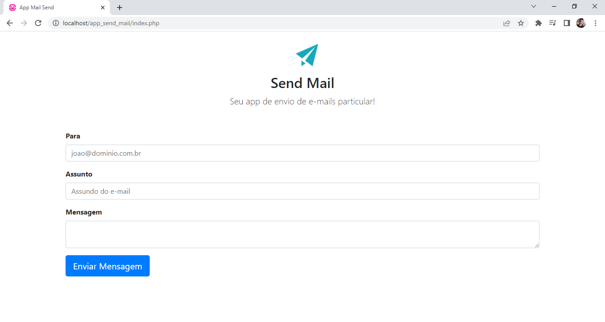

<h1 align="center">App Send Mail</h1>
 
 
 
 ## ✔️ Techniques and technologies used

- ``HTML5`` ``CSS3`` ``BootStrap`` ``PHP``

 

 

## 📁 Project access
You can access the project files by clicking [here](https://github.com/Coastony/app_help_desk)

## 🔎 Link of project
https://www.linkedin.com/posts/sergiobsantos_html-css-bootstrap-activity-7038605535373344768-KORo?utm_source=share&utm_medium=member_desktop
